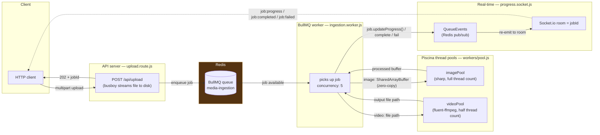

# SentinelScale

A high-performance media ingestion and processing server. Upload an image or video over HTTP, get a job ID back immediately, and watch it get resized/transcoded in the background with live progress over Socket.io.

Built around three ideas: **never buffer the full file in RAM**, **never block the event loop with CPU work**, and **never let a slow video job starve a fast image job**.

---

## Table of contents

- [How it works](#how-it-works)
- [Quick start](#quick-start)
- [Environment variables](#environment-variables)
- [API reference](#api-reference)
- [Socket.io protocol](#socketio-protocol)
- [Project layout](#project-layout)
- [Key design constraints](#key-design-constraints)
- [Contributing](#contributing)

---

## How it works

A file uploaded over HTTP never touches Node's CPU-bound work directly. It flows through four decoupled stages, connected by Redis:



1. **HTTP upload** ([`src/routes/upload.route.js`](src/routes/upload.route.js)) — `busboy` streams the multipart body straight to `uploads/` on disk; the request body is never buffered fully in memory. Once written, the route validates any scheduling options (see below) and enqueues a BullMQ job, responding `202` with a `jobId` before processing even starts.
2. **BullMQ queue** ([`src/queues/ingestion.queue.js`](src/queues/ingestion.queue.js)) — named `media-ingestion`, backed by Redis via `ioredis`. Jobs retry 3× with exponential backoff and BullMQ keeps the last 100 completed / 500 failed for inspection.
3. **BullMQ worker** ([`src/queues/ingestion.worker.js`](src/queues/ingestion.worker.js)) — picks up jobs at concurrency 5. Images are copied into a `SharedArrayBuffer` and dispatched to the image Piscina pool (zero-copy across the thread boundary); videos are dispatched by file path to the video pool. Calls `job.updateProgress()` throughout so clients see live percentages.
4. **Piscina thread pools** ([`src/workers/pool.js`](src/workers/pool.js)) — two separate pools so a handful of slow video transcodes can never starve fast image resizes:
   - [`image.worker.js`](src/workers/image.worker.js) — `sharp`, resize (`fit: inside`, no upscale), convert (default output: webp).
   - [`video.worker.js`](src/workers/video.worker.js) — `fluent-ffmpeg`, transcode to libx264 + aac, written to `os.tmpdir()`.
5. **Real-time progress** ([`src/sockets/progress.socket.js`](src/sockets/progress.socket.js)) — a BullMQ `QueueEvents` listener subscribes to Redis pub/sub and re-emits `progress` / `completed` / `failed` / `delayed` events into the matching Socket.io room (room name = `jobId`). Because this rides on Redis pub/sub rather than in-process EventEmitters, the API server and the BullMQ worker don't need to be the same process — you can scale them independently.
6. **Shared buffer util** ([`src/utils/sharedBuffer.js`](src/utils/sharedBuffer.js)) — copies a Node `Buffer` into a `SharedArrayBuffer` guarded by an `Atomics` spinlock, so image worker threads can read it with zero serialization overhead.

The worker deletes the temp upload file from `uploads/` once processing finishes.

### Delayed / scheduled jobs

Uploads can optionally be scheduled for the future instead of processed immediately — see [`docs/delayed-processing.md`](docs/delayed-processing.md) for a full walkthrough of how BullMQ's `delay` mechanism works and how the two scheduling fields (`delay`, `processAt`) are validated.

---

## Quick start

**Requirements:** Node.js ≥ 18 (for native `SharedArrayBuffer`), Docker (for Redis), `ffmpeg` on `PATH`.

```bash
# 1. Install dependencies
#    sharp / piscina / fluent-ffmpeg aren't wired into package.json yet — install everything explicitly:
npm install express bullmq ioredis piscina socket.io sharp busboy dotenv fluent-ffmpeg --save
npm install nodemon --save-dev

# 2. Create local directories
mkdir uploads processed

# 3. Configure environment
cp .env.example .env   # then fill in the values (see below)

# 4. Start Redis
docker-compose up -d

# 5. Start the server
npm run dev    # auto-restarts on file changes (nodemon)
# or
npm start      # plain node
```

Check it's alive:

```bash
curl http://localhost:3000/health
# {"status":"ok"}
```

`ffmpeg` must also be resolvable on `PATH` for video transcoding (`brew install ffmpeg` on Mac; install via your package manager on Linux/Windows, or bundle it into your Docker image for deployment).

---

## Environment variables

Create a `.env` file at the project root:

| Variable         | Required | Default              | Description                                                             |
|-------------------|:--------:|-----------------------|---------------------------------------------------------------------------|
| `PORT`            | ✅        | —                      | Port the HTTP/Socket.io server listens on.                               |
| `REDIS_HOST`      | ✅        | —                      | Redis host (e.g. `127.0.0.1`).                                           |
| `REDIS_PORT`      | ✅        | —                      | Redis port (e.g. `6379`).                                                |
| `MAX_QUEUE_SIZE`  | optional | `5000`                 | Max BullMQ *waiting* jobs before uploads are rejected with `503`.        |
| `MAX_DELAY_MS`    | optional | `86400000` (24h)       | Max milliseconds into the future a job can be scheduled.                 |
| `WORKER_THREADS`  | optional | `os.cpus().length`     | Thread count for the image Piscina pool (video pool uses half of this).  |

```env
PORT=3000
REDIS_HOST=127.0.0.1
REDIS_PORT=6379
MAX_QUEUE_SIZE=5000
MAX_DELAY_MS=86400000
WORKER_THREADS=
```

---

## API reference

### `POST /api/upload`

Multipart upload. Streams the file to disk, enqueues a processing job, and returns immediately.

**Form fields:**

| Field         | Type   | Required | Description                                                                 |
|----------------|--------|:--------:|-------------------------------------------------------------------------------|
| `file`         | file   | ✅        | The image or video to process.                                               |
| `width`        | number | optional | Passed through to the worker as `processingOptions.width`.                   |
| `height`       | number | optional | Passed through to the worker as `processingOptions.height`.                  |
| `format`       | string | optional | Output format (e.g. `webp`, `mp4`).                                          |
| `delay`        | number | optional | Process this many milliseconds from now. Mutually exclusive with `processAt`.|
| `processAt`    | string | optional | ISO 8601 timestamp to process at. Mutually exclusive with `delay`.           |

**Responses:**

| Status | Meaning                                                              |
|--------|-----------------------------------------------------------------------|
| `202`  | Accepted — `{ jobId, message, scheduledFor? }`                        |
| `400`  | Bad request — missing file, invalid/conflicting scheduling fields, or a schedule in the past / beyond `MAX_DELAY_MS`. |
| `415`  | Unsupported media type — file isn't `image/*` or `video/*`.           |
| `503`  | Queue at capacity (`MAX_QUEUE_SIZE` exceeded) — `{ error, retryAfter }`. |

```bash
curl -X POST http://localhost:3000/api/upload \
  -F "file=@photo.jpg;type=image/jpeg" \
  -F "width=800" \
  -F "format=webp"
```

```json
{ "jobId": "b3f1...", "message": "Upload accepted. Subscribe to this jobId for progress." }
```

### `GET /health`

Liveness check.

```json
{ "status": "ok" }
```

---

## Socket.io protocol

After a successful upload, connect to Socket.io and subscribe to the returned `jobId`:

```js
const socket = io('http://localhost:3000');

socket.emit('job:subscribe', jobId); // joins a room named after the jobId

socket.on('job:scheduled', ({ jobId, processAt }) => { /* only fires for delayed jobs */ });
socket.on('job:progress',  ({ jobId, progress }) => { /* progress: 0–100 */ });
socket.on('job:completed', ({ jobId, result })   => { /* result: worker output */ });
socket.on('job:failed',    ({ jobId, reason })   => { /* reason: error message */ });
```

These events are broadcast via BullMQ `QueueEvents` (Redis pub/sub), so this works across multiple server processes — the process handling the Socket.io connection doesn't need to be the same process running the BullMQ worker.

---

## Project layout

```
src/
├── server.js                    # entrypoint: wires up Express, Socket.io, and starts the worker
├── config/
│   └── RedisConfig.js           # ioredis connection config (maxRetriesPerRequest: null — required by BullMQ)
├── routes/
│   └── upload.route.js          # POST /api/upload — streaming multipart handler + scheduling validation
├── queues/
│   ├── ingestion.queue.js       # BullMQ Queue definition (retries, cleanup policy)
│   └── ingestion.worker.js      # BullMQ Worker — coordinates Piscina dispatch, reports progress
├── workers/
│   ├── pool.js                  # Piscina pool setup (imagePool / videoPool)
│   ├── image.worker.js          # sharp-based resize/convert (runs in a worker thread)
│   └── video.worker.js          # fluent-ffmpeg-based transcode (runs in a worker thread)
├── sockets/
│   └── progress.socket.js       # QueueEvents → Socket.io room re-emitter
└── utils/
    └── sharedBuffer.js          # Buffer → SharedArrayBuffer with Atomics spinlock

docs/
└── delayed-processing.md        # deep-dive on the delay/processAt scheduling feature
```

---

## Key design constraints

Worth understanding before touching the hot path:

- **Zero-copy image transfer.** Image bytes cross the main-thread → worker-thread boundary via `SharedArrayBuffer` + `Atomics`, never through the BullMQ job payload. A 50MB image cloned into every worker's job data would multiply memory use badly — don't serialize image buffers into job data.
- **Coordinator vs. CPU workers.** `src/queues/ingestion.worker.js` is the BullMQ *coordinator* — it doesn't do image/video processing itself, it dispatches to Piscina. The actual CPU-bound work lives in `src/workers/*.worker.js`. Keep that separation; don't move `sharp`/`ffmpeg` calls into the coordinator.
- **`maxRetriesPerRequest: null`.** BullMQ requires this on the ioredis config. The ioredis default (`20`) makes BullMQ throw on startup — don't "fix" this back to a number.
- **Two Piscina pools, not one.** Image and video processing are split into separate pools specifically so a batch of slow video transcodes can't block image jobs behind them. If you're tempted to merge them for simplicity, don't.
- **`server.js` must `require('./queues/ingestion.worker')`.** Without that line the worker never starts and jobs sit in the queue forever — it's a side-effecting require, not dead code.

---

## Contributing

Thanks for considering it — contributions of any size are welcome, from typo fixes to new worker types.

1. **Fork and clone** the repo, then follow [Quick start](#quick-start) to get a local environment running.
2. **Make your change.** A few things reviewers will look for:
   - No buffering full files into memory on the upload path.
   - CPU-bound work stays inside Piscina workers, never on the main thread or inside the BullMQ coordinator callback.
   - New env vars documented in this README and given a sensible default.
3. **Test manually** — there's no automated test suite yet (see below), so exercise the change by hand: upload a real file, watch the Socket.io events, check `redis-cli` for queue state if you touched scheduling or queue behavior.
4. **Open a PR** with a clear description of the *why*, not just the *what*. Link any relevant issue.

### Good first contributions

- Adding an automated test suite (none exists yet — this is the single highest-leverage contribution right now).
- Adding a linter/formatter config.
- Support for additional output formats in `image.worker.js` / `video.worker.js`.
- A `bull-board` (or similar) integration for visually inspecting the queue — see [`CLAUDE.local.md`](CLAUDE.local.md) local dev tips for the informal version of this.

### Reporting bugs / requesting features

Open a GitHub issue with steps to reproduce (for bugs) or the use case you're trying to solve (for features). If it's a processing bug, include the file type/size and the `processingOptions` you sent — that's almost always where the interesting variance is.
